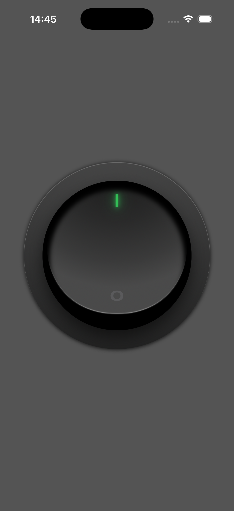
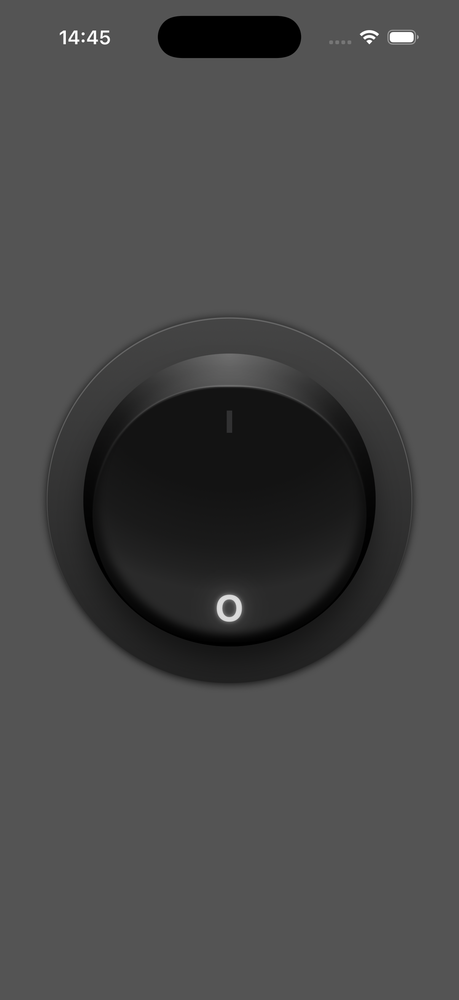

# NeumorphicToggle

A tactile rocker switch for SwiftUI modeled after the professional UI techniques found in [this Photoshop tutorial](https://design.tutsplus.com/tutorials/quick-tip-create-a-round-switch-button-in-photoshop--psd-16955). This component replicates physical depth through native gradients and inner shadows to simulate a realistic plastic switch recessed into a surface.

## 📱 Screenshots

| Toggle ON | Toggle OFF |
| --- | --- |
|  |  |

## 🛠 Features
* **Tactile Depth:** Mimics a physical rocker using vertical offsets and inverted highlights.
* **Dynamic Glow:** Includes a neon indicator with layered shadows for realistic light emission.
* **Adaptive Sizing:** Uses GeometryReader to scale all internal components to any frame size.
* **Pure SwiftUI:** High performance rendering with zero external image assets required.

## 🚀 Usage

```swift
NeumorphicToggle(isOn: $isOn)
    .frame(width: 300)
